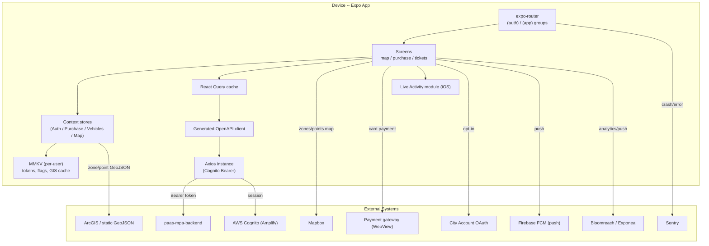
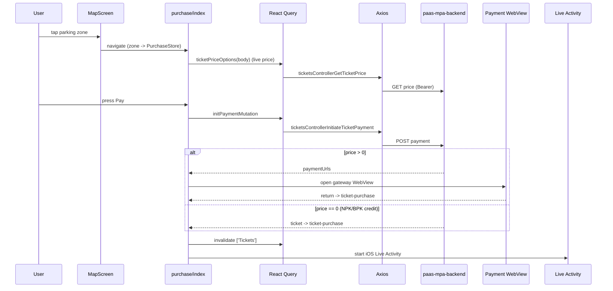

# PAAS Mobile App -- Architecture

## System Overview

The PAAS Mobile App is the native iOS/Android app for Bratislava's paid-parking system (**PAAS**). Users view a map of parking zones and points, buy parking tickets, prolong (extend) or shorten active tickets, manage vehicles and parking cards (resident/visitor/bonus cards), receive push notifications about ticket expiry, and answer feedback questionnaires. On iOS an active ticket is mirrored to a **Live Activity** (Dynamic Island / lock screen).

It is an **Expo / React Native** app using **expo-router** file-based routing, **TanStack React Query** for server state, **MMKV** for persistence, and a generated typed HTTP client against **`paas-mpa-backend`**. End-user auth is **AWS Cognito** (phone + SMS MFA) via Amplify; a secondary **City Account OAuth** flow gates push-notification opt-in.

### Environments

Environments are selected by **EAS build profile** (`eas.json`), each with its own `env` block. Env access is type-checked in `environment.ts` (`assertEnv`).

| Profile | Backend (`EXPO_PUBLIC_API_URL`) | City Account API | Cognito pool |
|---|---|---|---|
| development | `paas-mpa-backend.dev.bratislava.sk` | `nest-city-account.dev...` | `eu-central-1_pXpE6zBM0` |
| staging | `paas-mpa-backend.staging.bratislava.sk` | `nest-city-account.staging...` | `eu-central-1_pXpE6zBM0` |
| prod | `paas-mpa-backend.bratislava.sk` | `nest-city-account.bratislava.sk` | `eu-central-1_KAJt3SCx0` |

All environments use AWS region `eu-central-1`, Bloomreach/Exponea `api.eu1.exponea.com`, a shared Sentry DSN, and MinIO buckets `paas-mpa-{env}`. EAS project id `304d6880-...`, owner `bratislava`. App version `1.11.0` (`package.json` + `app.config.js`). iOS/Android bundle `com.bratislava.paas`.

---

## High-Level Architecture



---

## Routing / Screen Map (`app/`, expo-router)

`app/_layout.tsx` (root) sets up global providers, Sentry, OTA update check, and font loading; `app/(app)/_layout.tsx` gates on the Cognito user (redirect to `/onboarding`), wraps the app in map/vehicle/purchase/tickets/questionnaire providers, and mounts `NotificationHandler` + modals.

- **`app/(auth)/`** -- unauthenticated: `sign-in/index.tsx`, `sign-in/flag-search.tsx` (phone-prefix picker), `confirm-sign-in.tsx` (SMS MFA).
- **`app/(app)/`** -- authenticated:
  - `index.tsx` -- home = full-screen map (`MapScreen`) + menu + announcements badge.
  - `search.tsx`, `filters.tsx`, `zone-details.tsx`, `payment-options.tsx`, `announcements.tsx`, `menu.tsx`.
  - `tickets/` -- list (active/history) + `shorten/*` + filters.
  - `(purchase-and-payment)/` -- `purchase/*` (index, payment WebView, choose-vehicle, choose-payment-method), `prolongate/[ticketId]/*`, `ticket-purchase.tsx` (post-payment result).
  - `vehicles/*`, `parking-cards/*` + `verification/*`, `settings/*` (+ `notifications/*` with City Account login), `about/*`, `feedback/*`, `questionnaire/[id].tsx`, `dev/*` (dev-only showcases).
- **Top-level:** `app/onboarding.tsx`, `app/permissions.tsx`.

---

## Directory Map

| Directory | Purpose |
|---|---|
| `app/` | expo-router routes (above). |
| `components/` | UI + feature components: `map/` (Map, MapScreen, MapZones, MapMarkers, camera, bottom sheets, autocomplete), `tickets/`, `purchase/`, `controls/` (payment methods, vehicles, date-time), `notifications/` (Bloomreach + city-account UI), `special/` (`NotificationHandler`, `NoConnectionModal`, `StoreVersionControl`, `OmnipresentComponent`), `screen-layout/`, `shared/`, `showcases/` (dev). |
| `modules/backend/` | API layer: `client-api.ts`, `axios-instance.ts`, `constants/queryOptions.ts`, response interceptors, prefetch, `openapi-generated/`, `utils/fix-client.js`. |
| `modules/cognito/` | Amplify config + session/token helpers + sign-out. |
| `modules/auth/` | City Account OAuth (`useCityAccountSignIn`, token hooks). |
| `modules/map/` | Map constants/types + turf geo processing + camera/location/data hooks. |
| `modules/arcgis/` | GIS data fetching (live proxy + static GeoJSON), caching. |
| `modules/live-activity-module/` | Local Expo native module (iOS Swift) bridging Live Activities. |
| `hooks/` | Cross-cutting hooks (`useTranslation`, `useLiveActivities`, `useSignInOrSignUp`, `useDefaultPaymentOption`, `hooks/storage/*` MMKV flags). |
| `state/` | React Context stores (below). |
| `utils/` | Formatters (`formatPrice`, `formatDuration`, ...), `mmkv.ts`, error services, `licencePlate.ts`, `createPriceRequestBody.ts`, `paymentRedirect.ts`, `cn.ts`. |
| `plugins/` | Expo config plugins: `withBloomreach.plugin.cjs` (Exponea+Firebase push native wiring), `liveActivities.plugin.cjs`. |
| `targets/live-activity/` | Apple iOS Live Activity widget (SwiftUI + ActivityKit) via `@bacons/apple-targets`. |
| `translations/` | `sk.json`, `en.json`, `index.ts`. |

---

## Data Layer & State

- **React Query** -- single `QueryClient` in `app/_layout.tsx` (`retry: 0`). Query/mutation option factories centralized in `modules/backend/constants/queryOptions.ts` (active tickets, tickets infinite query, ticket price, get ticket, visitor/parking cards, vehicles, questionnaires, ...). Pagination via `modules/backend/utils/nextPageParam.ts`; start-up prefetch via `modules/backend/hooks/usePrefetchOnAppStart.tsx`.
- **Generated OpenAPI client** -- `modules/backend/openapi-generated/`, regenerated by `yarn generate-clients` from the staging backend's `/api-json`, post-processed by `modules/backend/utils/fix-client.js`. `client-api.ts` merges the generated `*ApiFactory` functions (Tickets, Vehicles, Users, ParkingCards, VerifiedEmails, Announcements, MobileDevices, FeedbackForms, Resources, Consent, System) into a single `clientApi` bound to `environment.apiUrl` and the shared axios instance. See **Generated API Client**.
- **Persisted state (MMKV)** -- default instance in `utils/mmkv.ts`; **per-user** instances via `state/AuthStoreProvider/useUserMMKVInstance.ts` (`useMMKV({ id: '<username>.storage' })`). Backs onboarding/first-purchase/questionnaire flags, default payment option, live-activities map, last-read announcement, language, and City Account OAuth tokens (`authentication_tokens`). Static ArcGIS GeoJSON cached with ETag. Cognito session tokens are managed internally by Amplify (not stored manually).
- **`state/` contexts** (Context + update-context pattern): `AuthStoreProvider` (Cognito user + Exponea config + splash), `PurchaseStoreProvider` (in-progress purchase: zone/vehicle/duration/npk/paymentOption), `VehiclesStoreProvider`, `TicketsFiltersStoreProvider`, `MapZonesProvider` (zone feature map, used by Live Activities), `MapStoreProvider`, `QuestionnaireProvider`.

---

## Authentication & Authorization

Two independent flows:

### (A) Primary -- AWS Cognito via Amplify (phone + SMS MFA)

1. Config in `modules/cognito/amplify.ts` (`Amplify.configure`, imported for side-effect in `app/_layout.tsx`).
2. Sign-in/up in `hooks/useSignInOrSignUp.ts` using Amplify `signIn`/`signUp`/`confirmSignIn` -- auto sign-up on `UserNotFoundException`, MFA via `CONFIRM_SIGN_IN_WITH_SMS_CODE`. Screens `app/(auth)/sign-in/*` -> `confirm-sign-in.tsx`. A **Cloudflare Turnstile** captcha token is passed as `clientMetadata` (validated by the backend's Cognito PreAuth Lambda).
3. Sign-out (`modules/cognito/hooks/useSignOut.ts`) unregisters the push token, calls Amplify `signOut`, clears Exponea + auth store.
4. **Cognito tokens are held/refreshed internally by Amplify**; `modules/cognito/utils.ts` exposes `getAccessToken()`.
5. **Token attachment** -- `modules/backend/axios-instance.ts` request interceptor calls `getAccessToken()` and sets `Authorization: Bearer <token>`. `useAxiosResponseInterceptors.ts` handles errors (422 local; status-based snackbars; network errors -> `NoConnectionModal`).
6. Global user state in `state/AuthStoreProvider`; auth gate in `app/(app)/_layout.tsx`.

### (B) Secondary -- City Account OAuth (push opt-in / verified identity)

`expo-auth-session` PKCE (`modules/auth/hooks/useCityAccountSignIn.ts`, scope `identity:verified`, redirect `paasmpa://settings/notifications/city-account-login`). These OAuth tokens **are** stored in MMKV (`authentication_tokens`).

---

## External Integrations

| Integration | Where | Purpose |
|---|---|---|
| **paas-mpa-backend** | `modules/backend/*` | All business data via the generated client; also serves i18n resource overrides. |
| **AWS Cognito / Amplify** | `modules/cognito/*` | Primary auth (see above). |
| **City Account** | `modules/auth/*` | Secondary OAuth for push opt-in. |
| **Mapbox** | `components/map/*`, `app/(app)/_layout.tsx` | Home map: parking zones (fill/line layers), clustered markers (parkomats, garages, P+R, partners, lots), user location, geocoding. Design notes in `docs/map.md`. |
| **ArcGIS / GIS** | `modules/arcgis/*`, `modules/map/utils/*` | Zone/point geometry from a live proxy + static S3 GeoJSON, cached in MMKV; `@turf/*` intersects markers with zones. |
| **Firebase FCM** | `modules/map/hooks/useRegisterDevice.ts`, `components/special/NotificationHandler.tsx` | Push token registration + notification-tap deep links. |
| **Bloomreach / Exponea** | `components/notifications/*`, `plugins/withBloomreach.plugin.cjs` | Analytics + push (through Firebase); customer identified by `custom:bloomreachId`. |
| **Sentry** | `app/_layout.tsx`, `app.config.js` | Crash/error reporting (production only). |
| **Payment gateway** | `app/(app)/(purchase-and-payment)/purchase/payment.tsx` | Card / Apple Pay / Google Pay via a WebView using URLs returned by the backend. |
| **MinIO** | `environment.minioBucket` | Object storage. |

---

## Data Lifecycle -- Buying a Ticket



Related flows: **shorten** (`tickets/shorten/index.tsx` -> `ticketsControllerShortenTicket`, ends Live Activity) and **prolongate** (`prolongate/[ticketId]/*`, prolongation price + payment).

---

## Localization

- `i18n.config.ts` -- i18next + react-i18next with `sk`/`en` from `translations/`, `fallbackLng: 'en'`, a custom detector persisted in MMKV (`settings.locale`), and **server-side resource overrides** fetched on language change (`resourcesControllerGetResources`).
- Extraction: `i18next-parser.config.js` scans `(app|components|hooks|state|utils|modules)/**` -> `translations/$LOCALE.json`. Uses `expo-localization` + `intl-pluralrules`. Language screen at `app/(app)/settings/language.tsx`.

---

## Generated API Client

```
yarn generate-clients
# openapi-generator-cli generate -i <staging>/api-json -g typescript-axios
#   -o modules/backend/openapi-generated && node modules/backend/utils/fix-client.js
```

- Source of truth: the staging `paas-mpa-backend` OpenAPI spec.
- Output post-processed by `fix-client.js`; config in `openapitools.json`. Regenerate rather than editing generated files when the backend changes.

---

## Deployment

- **EAS Build (`eas.json`)** -- profiles `development`, `development-simulator`, `preview`, `staging`, `prod`, `prod-test`; `appVersionSource: remote`, auto-increment on staging/prod; submit to Google Play `internal` and App Store (ASC app id `6457264414`).
- **OTA updates (`expo-updates`)** -- update URL + `runtimeVersion.policy: appVersion`; production launches auto check/fetch/reload. Tags containing `ota` run `eas update` instead of a full build.
- **Native config / plugins (`app.config.js`)** -- `expo-build-properties`, `@react-native-firebase/app`, `@rnmapbox/maps`, `expo-location/updates/localization/secure-store`, `@bacons/apple-targets` (Live Activity), the custom Bloomreach + Live-Activities plugins, and Sentry.
- **CI (`.github/workflows/`)** -- `build.yml` (tags `prod**`/`staging**` -> `eas build`/`eas update` with `--auto-submit`), `validate.yml` (PR: TS check + ESLint), `codeql-analysis.yml`.
- **Force update** -- `components/special/StoreVersionControl.tsx` prompts when the installed version is below the backend minimum.
- **E2E** -- Maestro flows in `.maestro/`.

---

> **Keep this doc in sync:** if a code change updates something described here (routing, purchase flow, auth, integrations, deployment), update this `ARCHITECTURE.md` in the same change.
